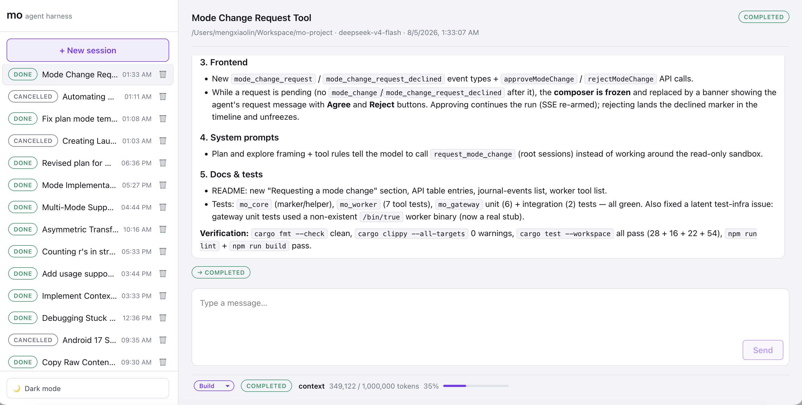

# mo (馍)

<p align="center">
  
</p>

> [!WARNING]
> Most, if not all, code of this project is generated by AI. This project is still in development.
> 
> The MVP is generated by [Deepseek-V4-Flash-0731](https://huggingface.co/deepseek-ai/DeepSeek-V4-Flash-0731) guided by a plan by [Kimi K3](https://huggingface.co/moonshotai/Kimi-K3).
>
> This project has only been tested with `Deepseek-V4-Flash-0731`.

A minimal, hackable coding-agent harness in Rust — an experimental project
inspired by [Pi](https://pi.dev/). "mo" (馍) is a kind of simple Chinese 
bread, and you can add anything you like into it. This name is also a 
playful nod to "pie". Like Pi, the philosophy is a *minimal* harness you 
adapt to your workflows*: keep the core small and explicit (gateway, 
worker, journal, SQLite) rather than building a sealed product.

## Screenshot



## Architecture

```
Frontend  <->  Gateway Service  <->  Agent worker(s)
                    |                    |
                    ----> SQLite DB <-----
                          Filesystem
```

| Piece | Role |
| --- | --- |
| `mo_core` | Shared types, JSONL journal I/O, SQLite metadata DB (WAL), TOML config, the session-mode registry (`build` / `plan` / `explore`), global skill discovery |
| `mo_gateway` | axum HTTP service: sessions CRUD, history, SSE live updates, worker spawn/kill, mode switching, the skill list + status-bar skill loading (port 3031) |
| `mo_worker` | One process per session: runs the LLM agent loop (via `nah_chat`) with tools `read_file`, `edit_file`, `create_file`, `remove_file`, `bash`, `bash_in_background`, `spawn_subagent`, `load_skill`, `request_mode_change`, `ask_user`; journals the system prompt once and reuses it verbatim on every run. The tool set is chosen per session in the "New session" form: `bash` + the file operations are always available, the rest may be disabled — disabled tools' schemas are not injected into the prompt and the worker refuses to execute them. Skills the user force-loads in the same form have their full `SKILL.md` inlined into the system prompt |
| `frontend` | React 19 + Vite + TS UI (Vite dev server on 3030, proxy `/api → :3031`) |

Workers append chat/tool events to a per-session `journal.jsonl` and update
their own row in the shared SQLite DB; the gateway only reads files + DB and
controls workers by process spawn/kill. The frontend gets live updates over
SSE (`GET /api/sessions/:id/events`).

## Layout

```
Cargo.toml                 # workspace, resolver 3, edition 2024
mo.toml.example            # example config file (copy to mo.toml)
crates/
  mo_core/                 # shared lib: types, journal, config, db
  mo_gateway/              # axum binary (port 3031)
  mo_worker/               # agent worker binary
frontend/                  # React 19 + Vite + TS
scripts/mock_llm.py        # OpenAI-compatible mock LLM for smoke tests
data/                      # runtime data dir (gitignored): mo.db + sessions/<id>/
```

## Configuration (`mo.toml`)

All configuration lives in a TOML file — models, ports, data dir, agents
dir, subagent depth. The gateway resolves it in this order:

1. `--config <file>` passed to `mo_gateway`
2. `$PWD/mo.toml`
3. `$HOME/.config/mo-agents/mo.toml`

With no config file anywhere, the gateway falls back to the legacy `MO_*`
env vars (`MO_MODEL_BASE_URL`, `MO_MODEL_NAME`, `MO_AUTH_TOKEN`,
`MO_DATA_DIR`, `MO_PORT`, ...). See `mo.toml.example` for a fully commented
template; the essentials:

```toml
port = 3031                    # gateway HTTP port (default 3031)
# data_dir = "./data"          # runtime data (default ./data)
# agents_dir = "~/.agents"     # global agents dir (default $HOME/.agents)
# subagent_depth = 0           # accepted for backward compatibility (no longer
                              # changes behavior): root sessions are always
                              # depth 0 (never framed as subagents); nesting is
                              # hard-capped at 1
# max_tool_concurrency = 8     # max tool calls from one assistant message
                              # that run concurrently (default 8, min 1)
# context_compression_threshold = 0.75
                              # fraction of the model's context_window at
                              # which the worker asks the model for a handoff
                              # prompt and sends only the compressed context
                              # (default 0.75; only when the model sets a
                              # context_window; see "Context compression")

# At least one model is required. The first one is the default model used
# to launch jobs and generate session titles; it is pre-selected in the
# "New session" UI.
[[models]]
base_url = "https://api.deepseek.com"
name = "deepseek-v4-flash"
token = "sk-..."               # optional: omit for endpoints without auth
nickname = "deepseek"          # optional label shown in the UI
# context_window = 65536       # optional: model context window in tokens;
                               # absent = unlimited. The session status bar
                               # shows the current context length against it.

[[models]]
base_url = "http://127.0.0.1:9001"
name = "smoke-model"
```

Workers are spawned with the chosen session's model (base URL, name, token,
context window) plus the data dir / agents dir / subagent depth in their
environment, so a config file replaces the old env-var setup entirely. The
worker also falls back to the same config file when run standalone.

## Run it

Prereqs: Rust 1.85+ (edition 2024), Node 20+.

```sh
# 0. Configure: copy the example and fill in your models
cp mo.toml.example mo.toml
$EDITOR mo.toml

# 1. Build
cargo build --workspace

# 2. Gateway (port 3031 by default; --config to point at a config file)
cargo run -p mo_gateway            # or: target/debug/mo_gateway --config /path/to/mo.toml

# 3. Frontend (dev server on http://localhost:3030, /api proxied to :3031)
cd frontend && npm install && npm run dev
```

Point the UI at a workdir (an absolute path containing the files the agent
may touch — it is sandboxed there), pick a model (the first configured one
is pre-selected), pick a mode, choose which optional tools the agent may
use, type a message, and watch the session stream live.
**Stop** kills the worker and its process group. When a run finishes or is
stopped, the composer unlocks: follow-up messages resume the same session,
and the worker rebuilds its context from the journal history.

### No API key? Use the mock

```sh
python3 scripts/mock_llm.py 9001 &      # replays canned SSE responses
# configure the mock as the default model in mo.toml:
#   [[models]]
#   base_url = "http://127.0.0.1:9001"
#   name = "smoke-model"
cargo run -p mo_gateway
```

The mock responds based on the prompt: prompts containing `subagent` exercise
`spawn_subagent`, prompts containing `ask_user` ask a clarification question
via `ask_user` (answer it with `POST /api/sessions/:id/ask/answer` to see the
run resume), prompts containing `permission` call `read_file` on a path
outside the workdir, so the worker holds the calls and shows a permission card (answer
it with `POST /api/sessions/:id/permission/answer` to see the held calls
complete and the run resume), prompts containing `slow` start a long-running `bash sleep`
(handy for testing cancel), anything else does `read_file` + `bash`. Final
answers are replayed as multiple content chunks, so the token-by-token
streaming path is exercised in smoke tests too.

## Modes

Every session runs in one of three **modes** — `build` (the default),
`plan` or `explore` — chosen in the "New session" form (and, for
subagents, via `spawn_subagent`'s `mode` argument, defaulting to the
parent's current mode). The mode shapes two things:

**System prompt.** The worker builds the system prompt from the session's
mode on the *first* run and **journals it as a `system_prompt` event**.
Every later run (followups, resumed sessions) reuses that journaled text
verbatim — it is never rebuilt, so mid-session changes to `AGENTS.md`,
skills or the mode never invalidate it, and the same system text is sent to
the LLM on every run (prompt-cache friendly). A session never picks up
`AGENTS.md`/skills edits mid-flight; create a new session for that.

**Write sandbox.** All modes expose the same tool set; what differs is
*where* `create_file` / `edit_file` / `remove_file` may land:

| Mode | Framing | Write sandbox |
| --- | --- | --- |
| `build` | Full coding-agent instructions: modify the codebase, run commands, use subagents and skills. | The codebase (workdir) |
| `plan` | Produce a clear, actionable implementation plan — do not implement yet. Codebase is **read-only**; use the scratch dir for drafts. `bash` and `bash_in_background` are available but should be treated as read-only (a soft restriction). Finish with the plan, then request `build` mode when the plan is ready and no must-answer questions remain. | The session scratch dir only |
| `explore` | Investigate the codebase to answer questions / gather facts for a parent agent. Codebase is **read-only**; prefer `read_file`. | The session scratch dir only |

The session scratch dir is `<data_dir>/sessions/<id>/tmp/` (created by the
worker, removed with the session). In `plan`/`explore` mode a mutation that
would land inside the codebase is denied with an explicit error telling the
model where it *may* write; writes inside the scratch dir use absolute
paths. `bash` and `bash_in_background` remain available everywhere — a
documented soft restriction (they can mutate state), not a hard one.

**File access permissions.** `read_file` / `edit_file` / `create_file` /
`remove_file` are automatically allowed for paths inside the working
directory and the session scratch dir (`read_file` also reaches global
skill folders). A call targeting any *other* path is not silently denied:
before executing a message's tool calls the worker *pre-flights* them, holds
every call whose path needs approval, and journals a single batched
`permission_request` (one item per held call) — the frontend shows an
**Allow / Deny card** listing every path in place of the composer, and the
run ends without sending anything to the model (the permission flow is
transparent to it). The user decides per path (**Allow / Deny** each, or
**Allow all / Deny all**); `POST /api/sessions/:id/permission/answer`
(`{request_id, decisions: {call_id: bool}}`) journals a batched
`permission_answered` event and respawns the worker, which re-runs the held
calls: allowed ones return their real result (file content, edit
confirmation, ...), denied ones return a denial error — the model sees the
outcomes as ordinary tool results and never has to "retry". Each decision
is remembered for that exact `(tool, path)` for the rest of the session, so
a later retry of an allowed path runs without prompting again and a retry
of a denied path is refused outright. Reads ask in every mode; writes ask
in `build` mode only — in `plan`/`explore` a write outside the scratch dir
is denied outright (never asked about, per the mode's write sandbox), and
subagents never ask (their journal has no UI); they report the need to
their parent agent.

**Switching modes.** A terminal session's mode can be switched from the
status-bar picker (`POST /api/sessions/:id/mode`; rejected while the
session is running). Switching changes only the write-sandbox policy of
subsequent runs — the journaled system prompt never changes — so before
the next user message the gateway injects a single **mode-change
message** (journaled as a `mode_change` event, shown in the timeline as a
notice row) when the switched-to mode differs from the mode the
conversation last ran under. At most one message is injected per followup:

- several switches before a single followup collapse into **one** message
  describing the *current* mode (intermediate switches never affected a run);
- switching back to the mode of the last run injects **nothing** (the
  journaled system prompt's framing is accurate again);
- a session that never ran injects **nothing** either (its first run builds
  the system prompt from the current mode).

The worker passes the notice to the model as a user-role message, so the
model sees the new mode's framing directly before the real user message.

**Switching models.** A terminal session's model can be switched from the
status-bar picker next to the mode picker (`POST /api/sessions/:id/model`;
rejected while the session is running). Switching only affects the *next*
run: the worker respawned for the next followup (or the mode-approve
continuation) is spawned with the new model's env (base URL, name, token,
context window), and the full journal history + the new user message are
sent to it — the journaled system prompt is model-agnostic and is reused
verbatim, so nothing about the context changes. Before that run the gateway
injects a single **model-change notice** (journaled as a `model_change`
event, shown in the timeline as a notice row) when the switched-to model
differs from the model the conversation last ran under — the last *model
marker* in the journal: the journaled `SystemPrompt`'s model (the model of
the first run, or of the run that followed a context compression) or a
previously injected `ModelChange`. Unlike the mode notice, it is never sent
to the model (flow metadata for the UI + audit trail only), but it follows
the same collapse rules:

- several switches before a single followup collapse into **one** event
  describing the *final* model (intermediate switches never affected a run);
- switching back to the model of the last run injects **nothing**;
- a session that never ran injects **nothing** either (its first run
  journals the SystemPrompt with the current model).

New subagents inherit the parent's current model at spawn; existing
subagents keep the model they were spawned with.

**Requesting a mode change.** When the model needs a mode it does not have
(e.g. a plan/explore session and the user asks it to build), it calls the
`request_mode_change` tool instead of working around the sandbox. The tool
takes the requested `mode` and a short `message` for the user — written in
the user's language — journals a `mode_change_request` event, and tells the
model to stop and wait. In plan mode the system prompt makes this the
*default* exit once the plan is ready: finish the plan, and if it has no
open questions the user must answer before implementation, call the tool
with mode `build` (the request replaces a plain-text "shall I proceed?" —
the user reviews the plan when approving); if the plan has must-answer
questions, the model lists them and waits for the user's answers instead.
The frontend shows an Agree / Reject banner and freezes the composer while
the request is pending (resolved = a `mode_change` or
`mode_change_request_declined` event after it). **Agree**
(`POST /api/sessions/:id/mode/approve`) switches the session's mode to the
requested one and continues the run with a single mode-change message (the
`mode_change` notice plus an "approved — continue" sentence), so the model
picks up where it left off with the new write sandbox. **Reject**
(`POST /api/sessions/:id/mode/reject`) journals a
`mode_change_request_declined` marker — no mode switch, nothing sent to the
model — and the composer unfreezes. Subagents cannot use the tool (their
journal has no UI); they must report the need to their parent agent.

**Asking the user questions.** When the model needs more input from the
user mid-task — a choice between approaches, a preference, or a detail
only the user can decide — it calls the `ask_user` tool with a single
question: `question_title` (the precise, concise headline), `question_text`
(a longer explanation) and `options` (each with a concise `option_title`
and an explanatory `option_text`; may be empty for a free-text-only
question). The system prompts for all three modes explicitly tell the model
to ask for clarification this way. The tool journals an
`ask_user_request` event (stage 1: one question per call — the model calls
the tool again for further questions, and a second call is refused while
one is pending) and tells the model to stop and wait. The frontend shows a
question card in place of the composer while the request is pending: every
option as a selectable card plus a final **empty free-text input box** —
the user answers by picking an option (the answer is that option's title)
or typing their own text. **Send answer** (`POST /api/sessions/:id/ask/
answer`, body `{answers: {<question_id>: <answer>}}`) journals an
`ask_user_answered` event and respawns the worker; the history rebuild maps
it to a user-role message carrying the answers as a JSON object keyed by
`question_id` (e.g. `{"q1": "Rust"}`), so the model receives the answer —
the tool's "return value" — and continues where it left off. Subagents
cannot use the tool; they must ask their parent agent instead.

## Session tools

Every session has a **tool set** chosen once in the "New session" form
(`GET /api/tools` serves the registry; the form renders one checkbox per
tool):

* **Always available** — `bash` (and its background variant
  `bash_in_background`) plus the file operations `read_file`,
  `edit_file`, `create_file` and `remove_file`. They are shown
  pre-checked and cannot be disabled: the harness itself is built on them,
  and the write sandbox / mode system would not work without them.
* **Toggleable** — `spawn_subagent`, `load_skill`, `request_mode_change`
  and `ask_user`. Each may be turned off for a session; a disabled tool's
  **schema is not injected into the prompt**, so the model cannot see or
  call it, and as defense in depth the worker refuses to execute a muted
  tool's name even if the model hallucinates it ("tool X is disabled in
  this session").

The choice is stored on the session row (`tools`, a JSON array of enabled
tool names) and is fixed for the session's lifetime — like the journaled
system prompt, it is decided up front and reused on every run. Subagents
inherit their parent's tool set (a session that banned `ask_user` does not
want its subagents asking the user either). Sessions created before tool
selection existed have no restriction (all tools enabled).

## Subagents

The `spawn_subagent` tool runs a nested agent session (same working
directory) and waits for its final answer. Subagents are **leaves**: the
depth hard limit is 1, so a subagent can never spawn further subagents.
Root sessions are depth 0 — they are never framed as subagents (the
`subagent_depth` config key is accepted for backward compatibility but no
longer changes behavior; the parent-id rule enforces the limit).

Subagent sessions are hidden from the session list (only root sessions
appear in the sidebar). They are reached through their parent: every
`spawn_subagent` call that actually spawns a child journals a
`subagent_started` event (carrying the child session id, the tool-call id
and the child's mode) in the parent's journal, and the matching tool block
shows a **view subagent →** button. Clicking it opens a read-only modal
that lists the subagent's messages live over SSE — there is no composer
(subagents never receive user input directly; their task is seeded into
their journal as the first user message). The child's DB title is
`Subagent for <parent session title>` rather than the task text.

Stopping or deleting a session stops/removes its subagents too: subagent
workers inherit the parent worker's process group, so the gateway's
process-group kill reaches them, and their rows are marked `cancelled` (or
deleted with the parent) at the same time.

## Streaming

The UI renders responses token-by-token. While the worker consumes the LLM
completion stream it journals each content chunk as a `message_delta` event
— including `reasoning_content` for reasoning models, which streams its
thinking first and then the visible answer — (plus a `tool_output_delta`
event per stdout/stderr chunk while `bash` is running); the gateway SSE
tail forwards them as they land, and the frontend appends them to the
in-flight message / tool block with a blinking caret and a `running` badge.
When the turn completes, the worker journals the final
`message`/`tool_result` events, and the frontend swaps the delta-built
preview for the canonical, complete text. Delta events are skipped when the
worker rebuilds chat history from the journal, so the model context stays
clean.

**Parallel tool calls.** Tool calls in a single assistant message run
*concurrently*, bounded by `max_tool_concurrency` (`mo.toml`, default 8).
The worker journals every `tool_call_start` up front, so the UI shows all
tool blocks at once; each `tool_result` lands as its call completes, so
some blocks finish before others and each bash output streams into its own
block. Tool results are fed back to the model in the *original* call order
(results looked up by call id), and the journal-based history rebuild
reorders them the same way, so the model-facing context is deterministic
regardless of completion order. Dependent calls should still be sent in
separate messages.

## Status bar

The session view has a status bar pinned to the bottom showing a mode
picker (`build` / `plan` / `explore` — switching a terminal session's mode
changes only the write sandbox of subsequent runs) with the **model
picker** side-by-side (switching only affects the next run — the respawned
worker is spawned with the new model and receives the full journal
history), a **Load a skill…** picker (sends the chosen skill's full
`SKILL.md` to the session as a new user message and respawns the worker —
see "Loading skills"; disabled while the session is running), the session
status badge and the current context length in tokens. The length comes
from the LLM API — the worker requests
`stream_options.include_usage` and journals the reported
`usage.prompt_tokens` after every LLM call as a `context_usage` event, so
the bar live-updates as the conversation grows
(tool outputs included) and survives reloads (rebuilt from history). When
the model config sets a `context_window`, the bar renders `used / window`
with a thin progress bar and a percentage, turning red at ≥ 90%; without
one the window is treated as unlimited and only the current length is
shown.

## Context compression (extremely long tasks)

When the session's context length reaches a fraction of the model's
`context_window` — `context_compression_threshold` in `mo.toml`, default
**0.75** — the worker asks the model to summarize the conversation into a
**handoff prompt** for the next session to start:

1. The original user input,
2. Facts about the environment (build/test commands, protocols, ports,
   file layouts, tools, gotchas),
3. Key decisions made so far and the reasons behind them,
4. Current progress: what has been done and what is still in the todo
   list,
5. The next step to take.

The worker journals the handoff as a `handoff` event, immediately followed
by a **fresh `system_prompt` event rebuilt from the session's current
mode** (the compressed context starts a new "session", so it gets the mode
system prompt). From then on the *handoff event is the compression
boundary*: the history rebuild drops every event with a `seq` below it from
the model context and sends the handoff text (wrapped in a `[Context
compressed …]` marker) as the first user message instead. **The earlier
events stay in the journal — and in the UI, above the "context compressed"
notice row — so the full history remains inspectable.** The run continues
in place; a later followup resumes from the compressed context, and if the
context grows large again the worker compresses once more (the newest
handoff wins).

Compression only applies when the session's model sets a `context_window`
(no window = unlimited = nothing to compress), and the trigger uses the
API-reported `usage.prompt_tokens`, so sessions whose provider does not
report usage are never compressed. Subagents compress too (they inherit
the parent's window and threshold).

## Legacy env vars

Configuration lives in `mo.toml` (see above). When no config file is found,
the gateway (and a standalone worker) falls back to these `MO_*` env vars —
kept for existing setups; new deployments should use the config file:

| Var | Used by | Default |
| --- | --- | --- |
| `MO_DATA_DIR` | gateway + worker | `./data` |
| `MO_AGENTS_DIR` | worker | `$HOME/.agents` |
| `MO_MODEL_BASE_URL` | worker (required) | — |
| `MO_MODEL_NAME` | worker (required) | — |
| `MO_AUTH_TOKEN` | worker | unset |
| `MO_SUBAGENT_DEPTH` | worker | `0` for root sessions (subagents inherit parent depth + 1; nesting is hard-capped at 1 — a subagent can never spawn further subagents) |
| `MO_MAX_TOOL_CONCURRENCY` | worker | `8` (max tool calls from one assistant message that run concurrently; min 1) |
| `MO_CONTEXT_COMPRESSION_THRESHOLD` | worker | `0.75` (fraction of the model's context window at which the worker asks for a handoff prompt and sends only the compressed context; see "Context compression") |
| `MO_WORKER_BIN` | gateway | sibling of `mo_gateway` exe named `mo_worker` |
| `MO_PORT` | gateway | `3031` |

## Global agent data (`$HOME/.agents`)

Global (user-level) instructions and skills live in a global agents dir —
`$HOME/.agents` by default, overridable with `MO_AGENTS_DIR`. The worker
injects them into every system prompt (root sessions **and** subagents):

```
$HOME/.agents/
  AGENTS.md                    # global instructions (optional)
  <skill-name>/SKILL.md        # global skill (optional)
  skills/<skill-name>/SKILL.md # global skill, alternate layout (optional)
```

- `AGENTS.md` is included verbatim as "Global instructions".
- Each skill's `SKILL.md` is parsed for YAML frontmatter (`name`,
  `description`); the system prompt lists only each skill's name +
  description. The `load_skill` tool returns the full `SKILL.md` body plus
  the absolute path of the skill's folder on demand, and `read_file` may
  read reference files, scripts, and other resources bundled inside skill
  folders (everything else stays sandboxed to the session workdir).
- Project instructions (`<workdir>/AGENTS.md`) come after the global
  instructions, so project rules can refine or override user defaults.

### Loading skills

Skills can be **force-loaded** in two ways, both driven by the user (not
the model):

- **At session creation** — the "New session" form has a **Skills** section
  (folded by default, next to the foldable Tools section; `GET /api/skills`
  serves every discovered skill) with one checkbox per skill. Checked
  skills are stored on the session row (`skills`, a JSON array of skill
  names) and their **full `SKILL.md` contents are inlined into the system
  prompt** on the first run (and again after a context compression), so the
  model has them from the start and they are dropped from the load-on-demand
  listing. Subagents inherit their parent's loaded skills. Sessions created
  before skill selection existed have none.
- **From the status bar** — the status bar has a **Load a skill…** picker
  next to the model picker (disabled while the session is running). Picking
  a skill journals its full `SKILL.md` as a **new user message** (wrapped
  in a marker so the model understands it is the user loading a skill) and
  respawns the worker, exactly like a followup message — `POST
  /api/sessions/:id/skills/load`. This is a one-off load: it is not
  persisted on the session row (unlike the New-session form), so a later
  context compression can fold it into the handoff like any other message.

## API

| Endpoint | Description |
| --- | --- |
| `GET /api/meta` | static gateway metadata: `{cwd}` (gateway startup dir, used as the default session workdir) |
| `GET /api/models` | configured models from `mo.toml` (`[{nickname, name, base_url, default}]`; first one is `default`) |
| `GET /api/modes` | built-in session modes: `[{name, label, description, tools, writable}]` (`build`, `plan`, `explore`) |
| `GET /api/tools` | the session tool registry for the "New session" checkbox list: `[{name, label, description, fixed}]` — `fixed` (bash + file operations) tools are always available, the rest may be disabled per session |
| `GET /api/skills` | every discovered global skill (both layouts, sorted, deduplicated): `[{name, description}]` — for the "New session" skill checkbox list and the status-bar "load skill" picker |
| `POST /api/sessions` `{workdir, prompt, model?, mode?, banned_tools?, skills?}` | create session + spawn worker (`model` = model name from `/api/models`, default when absent; `mode` = mode name from `/api/modes`, `build` when absent; `banned_tools` = the *toggleable* tools from `/api/tools` to disable for this session — disabled schemas are not injected into the prompt; absent/empty bans nothing, and fixed tools cannot be banned; `skills` = skill names from `/api/skills` to force-load — their full `SKILL.md` is injected into the system prompt at the first run; absent/empty force-loads nothing, and unknown names are rejected) |
| `GET /api/sessions` | list root sessions (newest first; subagent sessions are hidden — they are reached through their parent's tool blocks) |
| `GET /api/sessions/:id` | detail; liveness check flips dead workers to `failed` |
| `GET /api/sessions/:id/history?after_seq=N` | journal events after `N` |
| `GET /api/sessions/:id/events` | SSE tail: new events + synthesized status changes |
| `POST /api/sessions/:id/messages` `{content}` | continue a terminal session: journal the user message (preceded by a `mode_change` notice when the mode was switched since the last run and/or a `model_change` notice when the model was), reset to `pending`, respawn the worker |
| `POST /api/sessions/:id/skills/load` `{name}` | load a skill from the status bar: journal the skill's full `SKILL.md` as a new user message (wrapped in a marker) and respawn the worker — exactly like a followup, but nothing is persisted on the session row (unknown skill → 400; running session → 409) |
| `POST /api/sessions/:id/mode` `{mode}` | switch a terminal session's mode (409 while running): changes only the write sandbox of subsequent runs — the journaled system prompt never changes; the switch surfaces as a `mode_change` notice before the next user message |
| `POST /api/sessions/:id/model` `{model}` | switch a terminal session's model (409 while running): only the next run is affected — the respawned worker is spawned with the new model and receives the full journal history; the switch surfaces as a `model_change` notice before the next run that uses it |
| `POST /api/sessions/:id/mode/approve` | approve a pending `mode_change_request` (the agent called `request_mode_change`): switch the session's mode to the requested one and continue the run with a single `mode_change` notice (409 unless the journal's last mode marker is a pending request) |
| `POST /api/sessions/:id/mode/reject` | reject a pending `mode_change_request`: journal a `mode_change_request_declined` marker, no mode switch, nothing sent to the model (409 unless a request is pending) |
| `POST /api/sessions/:id/ask/answer` `{answers}` | the user answered a pending `ask_user_request` (the agent asked a clarification question via `ask_user`): `answers` is a JSON object keyed by `question_id` whose values are the chosen option's title or the user's typed text; journals an `ask_user_answered` event and resumes the run (409 unless a request is pending) |
| `POST /api/sessions/:id/permission/answer` `{request_id, decisions}` | the user decided a pending `permission_request` (file tools asked to access paths outside the working directory / scratch dir / skill folders): `decisions` maps each held call's id to Allow (`true`) / Deny (`false`) and must cover every item; journals a `permission_answered` event (one decision per item) and resumes the run — the held calls re-run: allowed ones return their real result, denied ones a denial error (409 unless a request is pending; legacy single-item requests still accept `{request_id, allowed}`) |
| `POST /api/sessions/:id/cancel` | mark cancelled, then SIGTERM → SIGKILL the worker process group |
| `DELETE /api/sessions/:id` | permanently delete a session: stop a running worker, remove the session dir (journal, worker log, ...) from disk, drop the DB row (`204` on success) |

Session status: `pending | running | completed | failed | cancelled`.
Journal events: `message`, `tool_call_start`, `tool_result`, `status_change`,
`system_prompt` (the system prompt, journaled once on the first run and
reused verbatim on every later run, carrying the mode it was built for —
after a context compression the worker journals a *fresh* one rebuilt for
the current mode), `mode_change` (a mode-change notice injected by the
gateway right before a followup user message when the session's mode
differs from the mode of the last run — or by `POST .../mode/approve` to
continue a run after a `mode_change_request`), `mode_change_request` (the
agent's request, via the `request_mode_change` tool, to switch the
session's mode, with the model's message for the user),
`mode_change_request_declined` (the user rejected the request),
`model_change` (a model-change notice injected by the gateway right before
a run when the session's model differs from the model of the last run:
`from` is the model of the last run, `to` is the new one; flow metadata —
never sent to the model, which is spawned with `to` regardless),
`ask_user_request` (the agent asked a clarification question via the
`ask_user` tool: the question with its options; the frontend shows a
question card while it is pending), `ask_user_answered` (the user answered:
a JSON object keyed by `question_id` whose values are the chosen option's
title or the user's typed text — the worker maps it to a user message, so
the model receives the answers),
`permission_request` (file tools asked the user for permission to access
paths outside the working directory / session scratch dir / skill folders:
one batched request per message with an `items` list — each item carries
the held call's id, tool name, `read`|`write` and path; the frontend shows
an Allow / Deny card while it is pending), `permission_answered` (the user
decided the pending request: one `decisions` entry per item with the
call id, tool, operation, path and `allowed` — the worker re-runs the held
calls on resume, so the model receives the real outcomes as ordinary tool
results),
`context_usage` (context length in tokens after each LLM call, from the
API's `usage.prompt_tokens`), `subagent_started` (a parent worker spawned a
subagent: child session id + the `spawn_subagent` tool-call id + the
child's mode), `handoff` (context compression: the model's handoff prompt,
with the mode it was generated under — everything with a lower `seq` is no
longer sent to the model but stays visible in the journal/UI), plus the
streaming previews `message_delta` (token-by-token assistant text and
reasoning) and `tool_output_delta` (live bash output) — JSONL, `seq` + `ts`
per line.

### Session titles

A new session is titled `New session - <time>` the moment the message is
sent. The gateway then makes a short, separate LLM call — using the default
(first) model from `mo.toml` — to generate a simple title from the first
user message and updates the DB — and with it the sidebar/header — when it
lands. If no model is configured or the call fails, the timestamped
placeholder stays.

## Development

```sh
cargo fmt --check
cargo clippy --all-targets
cargo test --workspace        # includes e2e agent-loop test vs a mock LLM
cd frontend && npm run lint && npm test && npm run build
```

## Copyright
Copyright (c) 2026 Mengxiao Lin. See [LICENSE](LICENSE) for license details.  